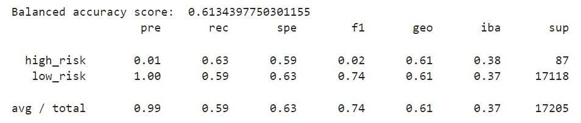
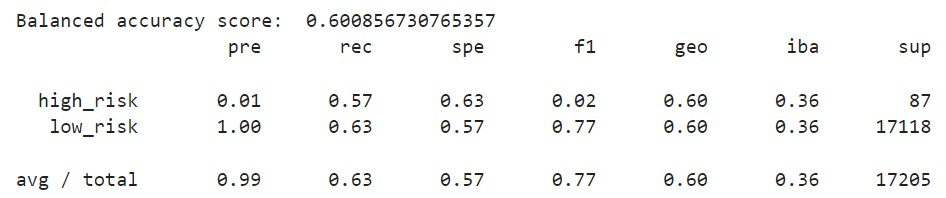
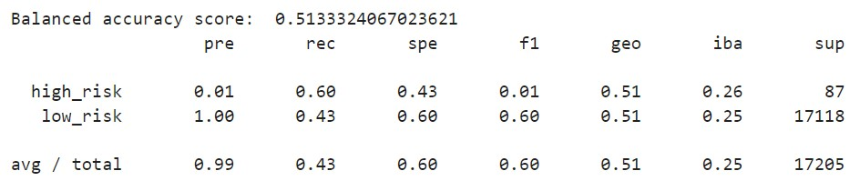
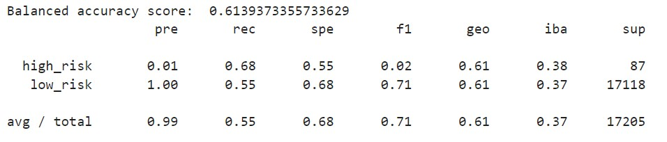
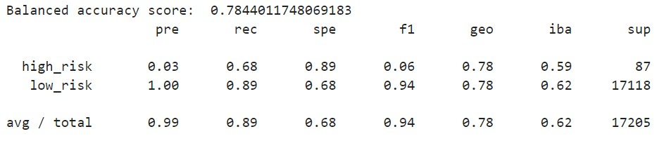
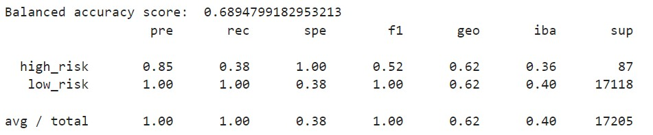

# Predict credit risk with Machine Learning algorithms

## Overview

We will be working with Fast Lending, a peer to peer lending services company wants to use Machine Learning to predict credit risk.  
They expect that this will lead to a more accurate identification of good candidates for loans which will lead to lower default rates.  
Since credit risk is an unbalanced classification problem as good loans easily outnumber risky loans, we will be applying models to work with balanced data, evaluate the performance and see how well the models predicted the data.

## Results

### Naive Random Oversampling

Balanced Accuracy: 0.61  
Precision high risk / low risk: 0.01 / 1.0 
Recall high risk / low risk: 0.63 / 0.59

### SMOTE Oversampling

Balanced Accuracy: 0.60 
Precision high risk / low risk: 0.01 / 1.0 
Recall high risk / low risk: 0.60 / 0.43

### Undersampling

Balanced Accuracy: 0.51 
Precision high risk / low risk: 0.01 / 1.0 
Recall high risk / low risk: 0.57 / 0.63

### Combination (Over and Under) Sampling

Balanced Accuracy: 0.61 
Precision high risk / low risk: 0.01 / 1.0 
Recall high risk / low risk: 0.68 / 0.55

### Balanced Random Forest Classifier

Balanced Accuracy: 0.78 
Precision high risk / low risk: 0.03 / 1.0 
Recall high risk / low risk: 0.68 / 0.89

### AdaBoost Classifier

Balanced Accuracy: 0.69 
Precision high risk / low risk: 0.85 / 1.0 
Recall high risk / low risk: 0.38 / 1.0

## Summary 

From all the models implemented the recommended to used will be the AdaBoost Classifier.  
For this scenario we will give more weigh to the precision rather than recall and its because we're interested
in having a more reliable classification of clients that are likely to be a high risk rathen than measuring how many high risk clients were corrected classified.  
This model has an accuracy of 69%, a precision for high risk of 85% and a precision for low risk of 100%.  
With this three measures we can assure that the default rates will decrease.

Another model with high accuracy is Balanced Random Forest Classifier (78%), but since it has a very low precision it wouldn't help Fast Lending to predict high risk clients.

For the models Naive Random Oversampling, SMOTE Oversampling, Undersampling and Combination (Over and Under) Sampling the precision is even lower than Random Forest Classifier that they would fail even more than this model to predict high risk clients.

